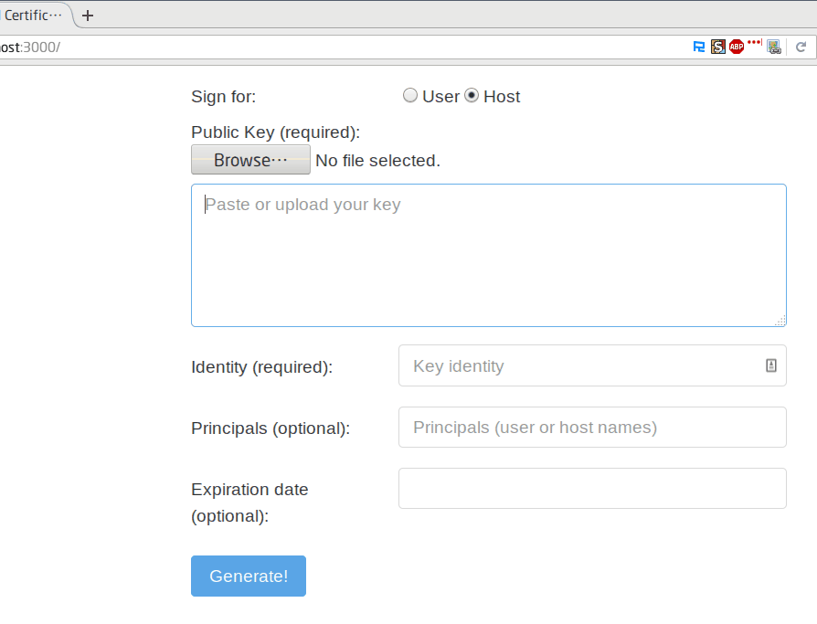

README
=======

### Introduction

A web frontend for OpenSSH Certificates generation.




### Quickstart

```
$ npm install
$ npm run build
$ export CAPATH=<path to your ca key>
$ export PASSPHRASE=<your passphrase>
$ npm start
```

### TODO

* [ ] Docker support
* [ ] Certificate option support

### 一点碎碎念

其实我一直想入前端的坑很久了, 但无奈前端的技术栈变化得实在太快, 往往是刚开始摸一样工具/框架, 已经有更优秀的后起之秀取而代之了. 所幸最近貌似有大局已定的趋势, 其中 [Vue.js](https://github.com/vuejs/vue) 这个框架深得我心:

* 基于 MVVM 模型, 通过双向数据绑定连接 View 和 Model 层. 只要改一下数据, 就能触发视图的更新. 对于我这个日常偏向于后端开发的人来说, 效果是相当震撼的
* 采用简单的模板语法来渲染数据. 我之前写后台程序的时候用的是 Python + Jinja2, 所以对于 Vue 模板还是比较有亲切感的. 而且个人觉得模板比起 JSX 给人的感觉要清爽一点, 一堆 HTML 杂糅在 JS 里怎么看都觉得很奇怪 = =.
* 文档很齐全, 有丰富的样例能参考

目前我对于前端也不是很熟悉, 属于刚入坑的水平. 写这个项目的时候, 花时间最多的是设计网页 QAQ... 因为对各种库以及 HTML 里各种标签的作用都并不熟悉, 就需要到处找文档. 但有时找文档也会有坑, 比方说刚开始我没留意到自己用的是 bootstrap V3, 找到了一个 V4 的文档就开始学, 但实际效果就是跟预期不符... 另外我还有点轻微的强迫症, 所以网页里的元素如果不对齐的话就会感到不爽, 但 CSS 这个东西目前在我看来还是挺玄学的, 有各种 magic... 不过最终还是做出来了, 真的挺有成就感的.

这个项目姑且作为我学习 Vue 的起点吧, 虽然也没用到太多高级的特性, 但写起来还是挺有意思的. 未来考虑学习使用下怎么用 webpack 构建项目, 现在靠纯手工来生成生产环境下的代码还是相当麻烦的.

最后, Happy Hacking 2017 !
